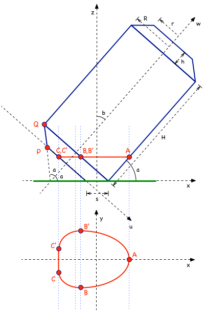

# The Equilibrium of a Tilted Soda Can

Did you know that you can balance a partially filled soda can when it's tilted? Here I analyse the mathematics of why and when that is possible.

I've gotten quite far on this but it's still work in progress. Originally written on July 20, 2014.

## License

I'm sharing this work under the [Creative Commons Attribution-ShareAlike 4.0 International (CC BY-SA 4.0)](http://creativecommons.org/licenses/by-sa/4.0/) license. See the LICENSE file for more information.
